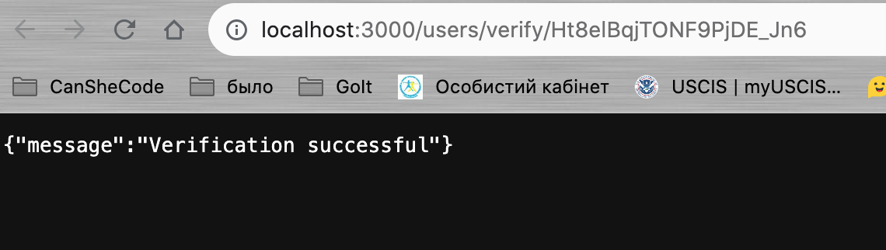

Добавление аватара

В Postman выбираем метод POST, form-data, key-avatar, вместо Text быбираем File, прикрепляем аватар.

1.npm install --save multer
Инсталл. multer

2.npm run start:dev
Запустим проект

1. В app.js прописываем app.use(express.static("public")); - Если придет запрос на статичный файл, его нужно искать в папке public

4.Сначала создаем необходимые папки, в которых multer будет временно хранить файлы: temp (она будет пустой, но пустые папки на Git не пушатся), поэтому создаем в ней пустой файл .gitkeep

5.Создаем public/avatars. Файлы, которые будем отдавать на фронтенд, будем сохранять в папке public/avatars - там будем хранить аватары пользователей, создаем в ней пустой файл .gitkeep

6.Создаем новый файл multer-config.js в папке middlewares. Импортируем multer и создаем объект настроек multerConfig, а потом с его помощью middleware - upload, который будет загружать файлы

3.Из multer сделать middleware, чтобы файлы ложить во временную папку, а в request body записывать текст. Текстовые поля идут в request body, а файлы - в папку, котоую укажем.

7.В multer-config.js - Создаем объект настроек - multerConfig, вызываем метод discStorage и передаем ему объект, в котором описываем настройки - нужна только 1 обязательная настройка - destination (путь ко временной папке), адрес запроса пишем через path, поэтому импортируем path

8.Создаем путь ко временной папке - tempDir (все файлы сначала будут сохраняться тут)

9.Вторая настройка - это filename - туда мы передаем функцию и она может сохранить нам файл не под тем именем, под которым он пришел, это иногда необходимо

10.Создаем middleware (upload)- вызываем multer как функцию, передаем объект настроек - в свойстве storage указываем multerConfig - настройки multer. Middleware готов, она будет сохранять файлы в папке tempDir под оригинальным именем (originalname)

В схему user добавляем
avatarURL: {
type: String,
required: true,
},

для создания аватарки при регистрации установим пакет gravatar

импортируем gravatar в controllers/auth.js
чтобы сгенерировать ссылку на временный аватар, у объeкта gravatar вызываем метод url и передаем email и сохраняем в базе. Теперь, когда человек регистрируется, ему будет дана временная аватарка.

В routes/api/auth.js дописываем маршрут PATCH, чтобы залогиненный пользователь имел возможность заменить аватарку.

После регистрации, логина, можно взять токен и использовать его в PATCH запросе для смены аватарки.

В routes/api/auth.js добавляем в PATCH запрос на avatars, authenticate и где будет передаваться 1 поле avatars с файлом.

Дальше пишем контроллер updateAvatars в controllers/auth.js.
Сохраняем путь к папке с аватарками - avatarsDir, импортируем path.
Импортируем путь tempUpload и originalname.
Создаем путь где файл должен сохраниться resultUpload.
С помощью fs.rename перемещаем файл со временного места - папки temp в постоянное - public/avatars.
Теперь записываем файл в базу - создаем avatarURL. Благодаря middleware aithenticate в req.user у нас сохраняется id пользователя, который делает запрос.
Зная этот id мы можем перезаписать avatarURL.
Нужно сделать уникальное имя файла - мы берем originalname и дописываем к нему id пользователя.

Обработать аватарку пакетом npm i jimp.

<!-- 11.Для middleware upload нужно указать в каких полях мы ожидаем файл. мы ожидаем 1 файл в поле avatar - upload.single("avatar") - это указано также в Postman - /avatars - POST - form-data - avatar + загруженное фото

12.Нажав send в Postman, middleware сохранил фото в папке temp, в req.file - информацию про файл, а в req.body - все текстовые элементы. Далее контроллер берет файл из временной папки и делает с ним то, что необходимо.

13.// upload.array("avatar", 8) - если нужно загрузить больше, чем 1 файл - название поля, количество

14.// upload.fields([{name: "cover", maxCount: 1}, {name: "subcover", maxCount: 2}]) - если ожидаем файлы в разных полях

15.Теперь нужно переместить файлы из temp в public/avatars. За все перемещения файлов отвечает пакет fs. Импортируем его

16.Чтобы переместить файл, в fs используется метод rename -
await fs.rename(tempUpload, resultUpload); -
1й аргумент - старый путь к файлу + его имя; 2й аргумент - новый путь к файлу + его имя;

17.Записываем в базу новый аватар

18.Прописываем app.use(express.static("public")); - Если придет запрос на статичный файл, его нужно искать в папке public -->

---

РЕГИСТРАЦИЯ ПОЛЬЗОВАТЕЛЯ ЧЕРЕЗ ПОДТВЕРЖДЕНИЕ ЕГО ИМЕЙЛА

ВАРИАНТ 1 - Sendgrid

Backend отправляет имейл посреднику - SendGrid - а он его проверит и будет уже заниматься его доставкой.

регистрируемся на sendgrid.com

.......

ВАРИАНТ 2 -

В папке helpers создаем файл sendEmail.js

<!-- Создаем универсальную функцию sendEmail - есть 1 имейл, с которого мы отправляем почту, то есть в поле from будет всегда одиноковый текст. А кому отправлять, тема и текст сообщения будут разными. Поэтому функция sendEmail получит как аргумент в параметре data объект? где записано to, subject и html, мы распыляем эти данные, дописываем поле from и отправляем имейл. Возвращает true если все хорошо, если нет, то выбрасывает ошибку и с ней разбарается контроллер. -->

регистрируемся на портале meta.ua, устанавливаем в настройках POP3/SMTP сервер. С этого имейла почта будет уходить регистрирующемуся пользователю.

устанавливаем пакет Nodemailer - it is a module for Node.js applications to allow easy email sending. - npm install nodemailer

в .env сохраняем пароль от почты - META_PASSWORD

В файл helpers/sendEmail.js импортируем Nodemailer;
вызываем equire("dotenv").config(); - чтобы читать .env файл с переменными окружения;
забираем с переменных окружения пароль META_PASSWORD;
создаем объект настроек для Nodemailer - nodemailerConfig - туда вписываем адрес почтового сервера исходящей почты, к которому надо подключиться - host: "smtp.meta.ua",
порт на почтовом сервере, к которому надо подключиться - port: 465,
надо ли шифровать трафик - secure: true,
объект auth, в котором мы указываем user: "margar1n@meta.ua" - какую почту искать на сервере smtp.meta.ua и пароль от почты - pass: META_PASSWORD.

чтоб отправить письмо, нужно с помощью nodemailerConfig создать transport - у nodemailer мы вызываем метод configTransport, передаем nodemailerConfig и получаем объект transport, который будет заниматься доставкой почты.

чтобы отправить почту, в объекте transport вызываем метод sendMail и передаем email, нам возвращается promise.

запускаем проект и отправляем почту - получаем 550 ошибку про спам

теперь нам надо сделать так, чтобы человек, который регистрируется на проекте, мог подтвердить свой имейл - после регистрации получил письмо на почту со ссылкой на подтверждение имейла, пока он не подтвердит, не сможет залогиниться.

делаем экспорт transport в index.js

В модели users.js в mongoose схеме надо добавить поля, которые указывают на то, что пользователь подтвердил свой имейл -

- verify - по умолчанию будет false, то есть пользователь зарегистрировался, но еще не подтвердил свой имейл.
- verificationCode - это код подтверждение, который будет приходить на почту.

В контроллере регистрации controllers/auth.js нам нужно создать verificationCode и тоже записать его в базе.
Импортироем nanoid, создаем verificationCode и записываем его в newUser.

После регистрации нам нужно отправить пользователю имейл со ссылкой на подтверждение его имейла.
В controllers/auth.js из helpers импортируем transport и создаем имейл для подтверждения verifyEmail. Кому (to) - человеку, который зарегистрировался, тема (subject) - подтвердить имейл, в поле html мы должны прислать ссылку "Click verify email".
В тег <a> вписываем адрес нашего backend. При переходе по ссылке всегда срабатывает GET запрос. Так как у каждого пользователя долен быть уникальный адрес для верификации, то в конце адреса мы вписываем verificationCode. BASE_URL после деплоя будет другим.

Данные, которые локально и после деплоя будут разными, тоже записывают в переменную окружения .env. - BASE_URL=http://localhost:3000 - этот адрес, когда запускаем проект локально.
Импортируем BASE_URL в переменные окружения process.env
Вызываем transport и отсылаем verifyEmail.

Пробуем в Postman пройти регистрацию

Register

 - verify: false, verificationCode:"..."

Во временном имейле yesetet911@arensus.com появилось сообщение со ссылкой

Открываем сообщение

Нажали на ссылку
 - в адресной строке в конце адреса видим verificationCode пользователя.

Сейчас залогиниться пользователь может даже без подтверждения имейла, нужно это исправить.
В controllers/auth.js в login добавляем

if (!user.verify) {
throw HttpError(401, "Email not verified");
}

Переходя по ссылке из письма для подтверждения имейла, пользователь видит {"message":"Not found"} - такой страницы не существует. Поэтому нам нужно создать новый роутер:

В routes/api/auth.js создаем router.get("/verify/:verificationCode", ctrl.verifyEmail);

пишем контроллер verifyEmail в controllers/auth.js и экспортируем его.
Берем из req.params verificationCode и проверяем есть ли в базе пользователь с таким кодом. Если его нет - выбрасываем ошибку, если есть - то обновляем базу данных с помощью findByIdAndUpdate, поле verify ставим в true, а verificationCode делаем пустым.

Теперь, при переходе по ссылке из письма про верификацию имейла, пользователь получит сообщение {"message":"Verification successful"}:

В базе будет verify:true и пользователь сможет залогиниться:

Но письма с верификацией приходят не всегда. Может быть так, что пользователь зарегистрировался, письмо отправлено, но не дошло, без подтверждения пользователь не сможет зарегистрироваться еще раз так как его данные в базе уже есть.
Для этого на frontend есть страница для ввода имейла, если он есть в базе - письмо с подтверждением высылают еще раз.

В routes/api/auth.js создаем новый роутер router.post("/verify", validateBody(schemas.emailSchema), ctrl.resendVerifyEmail);
Для получения повторного письма пользователю нужно будет ввести только свой имейл.
Так как у нас есть тело запроса в формате JSON, нам надо его проверить с помощью Joi. Но у нас нет схемы валидации, поэтому создаем ее в models/user.js - emailSchema.

Если все хорошо, вызываем контроллер resendVerifyEmail - создаем его в controllers/auth.js.
Для этого берем из тела запроса имейл и проветяем есть ли такой имейл в базе.

Если нет - выбрасываем ошибку:

если пользователь уже верифицирован - выбрасываем другую ошибку:

если есть такой имейл в базе, но он не подтвержден, то нам нужно снова отправить письмо: создаем verifyEmail, verificationCode уже берем из базы - user.verificationCode, его не нужно генерировать заново, отправляем его и отправляем сообщение "Verificational email sent".

---

DOCKER

1. Регистрируемся на сайте - https://hub.docker.com/
2. Загружаем Docker - https://www.docker.com/products/docker-desktop/
3. Docker всегда должен быть запущен в фоновом режиме.
4. В VS Code поставить расширение Docker
5. В VS Code в корневом каталоге создаем файл Dockerfile - с иконкой кита.
6. В нем мы описываем Docker-образ - пишем иснтрукцию для постороннего человека что ему установить, скопировать и какой командой запустить проект.
   
7. Берем готовый образ Node.js в https://hub.docker.com/ - в поисковой строке вводим "Node".
8. В терминале VS Code вводим docker pull node - копируем себе полностью образ с сайта.
9. Чтобы собрать его самостоятельно, в файле Dockerfile пишем:
   FROM node - на основе какого образа создать наш проект;
   WORKDIR /app - команда, которая создает рабочую директорию, в которой будет наш проект - эта папка сейчас пустая.
10. COPY . . - Скопировать файлы в проект, указать откуда и куда. Docker file в корне проекта, поэтому ставим "." => пробел => "." (в главный каталог /app)
11. RUN npm install - Поставить Node модули (пакеты) из package.json. Через RUN пишутся команды в консоли.
12. EXPOSE 3000 - номер порта, на котором запускаем проект.
13. CMD ["node", "server"] - Команда запуска проекта. Пишется через CMD и это массив, каждая строка которого это 1 слово команды.
14. Превращаем набор команд в образ "- docker build ." (в терминале)
15. В docker desktop в Images появится проект.
16. Командой "docker images" в терминале можно увидеть созданные образы.
17. Чтобы запустить образ, нужно его распаковать - создать на его основе докер-контейнер и запустить приложение: в интерфейсе нажать команду RUN.
    Или в терминале: "docker run -id образа-" или "docker start -id образа-"
     - running
18. В терминале писать не могу, нужно остановить контейнер - Stop в Docker desktop или создать новый терминал и в нем ввести "docker ps" - показывает все запущенные контейнеры; "docker stop -id запущенного контейнера-"
     - no containers are running
19. Чтобы создать образ, но не заходить в консоль докера, пишем "docker run -d 40cb4f365209" - теперь чтобы его остановить, не нужно создавать новую консоль.
20. docker run -d -p 4000:3000 aaf44d9e1006 - 4000 это порт VPS (на нашем виртуальном сервере), 3000 - локальный, который запущен внутри контейнера.
21. В браузере в адресной строке вводим localhost:4000, должно появиться
     - запустился
